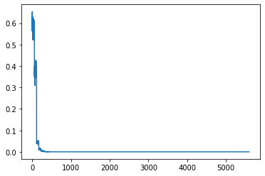

# Capstone Project


### Data Cleaning

First and the formost process in any machine learning problem is to look into data, the dataset consista of questions and their equivalent codes

#### These were following issues with data set  

1. Some questons started with # and others started with numbers so we had to make them all start with a question like syntax like `write a program`
2. Also to identify that if a perticular statement is a question or a comment we had to write rules to clean comments up first
3. Indentation problem, some programs were having tabs some had spaces and the other had mixed characters like tab, spaces

Following are some of the rules used for cleaning up dataset
1. `Manually Preprocess Data ie remove any extra '# ' from data set`
2. `<space> def` -> `def`
3. `#write` -> `# write`
4. `\n#\s?\d+` -> `\n# `  // Convert all numbered statements to un numbered
5. `\d+\.\s?\n# write` -> `# write`
6. `# Define` -> `# write`
7. `\n#.python ? 3? ?` -> `\n# write `
8. `\n#.Write (?!a)` -> `\n# write a`
9. `\n#.Write` -> `\n# write`
10. `#.program` -> `# write a program`
11. `\n\s*\n\s*\n+` -> `\n\n`,
12. `\n?# In\[\d+\]:\s*\n?` -> `\n`
13. `\n\s*\n(?!#.write)` -> `\n\n`
14. `Remove all un necessary comments`
15. `Remove all un necessary new lines`
16. `Remove all extra spcaes and replace them with tabs`
17. `Split each program into pairs of statement and code`
18. `(#.program|#.write)`

### Tokenization

As ths is a unique dataset where there are a couple number of special characters and other keywords which needs to be together

#### Following were some of the considerations needed to take in picture while writing a tokenizer
1. names can have `_` (underscore)
2. there are characters like `\n` and `\t` they needs to be a single word

To cater to these needs we had to write out custom tokenizer extending `spacy` tokenizer

    ```
    from spacy.util import compile_prefix_regex, compile_infix_regex, compile_suffix_regex
    from spacy.tokenizer import Tokenizer

    def custom_tokenizer(nlp):
        infix_re = re.compile(
            r'''[.\,\?\:\;\...\‘\’\`\“\”\"\'\(\)\[\]\{\}\*\%\^\+\-\=\<\>\|\!(//)(\n)(\t)~]''')
        prefix_re = compile_prefix_regex(nlp.Defaults.prefixes)
        suffix_re = compile_suffix_regex(nlp.Defaults.suffixes)

        return Tokenizer(nlp.vocab, prefix_search=prefix_re.search,
                        suffix_search=suffix_re.search,
                        infix_finditer=infix_re.finditer,
                        token_match=None)


    spacy_que = spacy.load('en_core_web_sm')
    spacy_ans = spacy.load('en_core_web_sm')
    spacy_ans.tokenizer = custom_tokenizer(spacy_ans)


    def tokenize_que(text):
        """
        Tokenizes English text from a string into a list of strings
        """
        return [tok.text for tok in spacy_que.tokenizer(text)]


    def tokenize_ans(text):
        """
        Tokenizes Code text from a string into a list of strings
        """
        return [tok.text for tok in spacy_ans.tokenizer(text)]
    ```

### Pretrained Embeddings

It is already proven that using pretrained embedding makes network learn faster and converge easier with a less number ot epochs

#### We trained a custom glove embedding with 300 dimensions 

we trained this glove embedding for 100 epochs and reached a descent loss (9.974439516472449e-13)




#### Using these pretrained embeddings

1. While building vocabulary for answers we added these pretrained embedding vocabulary
    ```
    Answer.build_vocab(train_data, vectors=torchtext.vocab.Vectors("./python_code_glove_embedding_300.txt"), min_freq=2)
    ```

2. After applying initial weights we updated decoder embeddings with pretrained embeddings
    ```
    glove_pretrained_embeddings = Answer.vocab.vectors
    model.decoder.tok_embedding.weight.data = glove_pretrained_embeddings.to(device)
    ```

We also experimented with embeddings size of 50, 100, 250 but they din't work well so finally ended using 300 dimension embeddings

### Hyper parameters

We experimented with a couple number of hyper parameters

1. First approach was to get a stable network which is powefull enough or has a capacity to learn souch a complex dataset. We started with a small network and then with a number of experiments er reached at a network with  following parameter

    ```
    INPUT_DIM: 1451
    OUTPUT_DIM: 3299
    HID_DIM: 300
    ENC_LAYERS: 4
    DEC_LAYERS: 4
    ENC_HEADS: 5
    DEC_HEADS: 5
    ENC_PF_DIM: 512
    DEC_PF_DIM: 512
    ENC_DROPOUT: 0.1
    DEC_DROPOUT: 0.1
    ```

2. After finalizing on network size we experimented on batch size which is optimal enough for network to learn better, experiment included batch size ranging from `4` to `512` and finally ended up with `32` as optimal batch size for network

3. One of the most important hyper parameter is learning rate which took a bit of time for us to arrive a a good number, we experimented a number of sterategy but finally ended up with one cucle lr as the best suited for us. To fine tune one cycle `lr` we used grid search with manual numbers we use following lines of code to add manual one cycle lr 

    ```
    # One cycle schedule with custome function
    schedule = np.interp(np.arange(N_EPOCHS+1), [0, 5, 20, N_EPOCHS], [LEARNING_RATE, MAX_LR, LEARNING_RATE/5.0, LEARNING_RATE/10.0])
    def lr_schedules(epoch):
        return schedule[epoch+1]
    ```

    Also added following code to training loop to update learning rate based on epochs

    ```
    optimizer.param_groups[0]['lr'] = lr_schedules(epoch)
    ```

    Finally after multiple iterations we ended up with following numbers

    ```
    LEARNING_RATE: 0.0005
    MAX_LR: 0.001
    N_EPOCHS: 24
    CLIP: 1
    STEPS_PER_EPOCH: 220
    ```

    then we used these numbers in pytorch onc cycle lr sterategy with linear analying to train our network

    ```
    scheduler = torch.optim.lr_scheduler.OneCycleLR(optimizer, max_lr=MAX_LR, steps_per_epoch=STEPS_PER_EPOCH, epochs=N_EPOCHS, anneal_strategy='linear')
    ```

    Also we added following code after optimizer step to step scheduler after every batch

    ```
    optimizer.step()

    scheduler.step()
    ```

### Optimizer and Loss Function

We tried with different functions but notting worked better than the default ones, we tried label smoothing but it made not a big difference as results were not so great


### Dataset extension

To get a better and robust network we used a thirdparty dataset called `conala` dataset this is open sourse dataset, this gave us a very beautiful improvement on accuracy for out existing data.
### Training Logs

We trained our networ a couple number of times and we saved some of logs as best logs you can find some of them [here](/logs), the best one for us was the one which I want to highlight here

    Learning Rate: 4e-05
    Epoch: 01 | Time: 0m 15s
        Train Loss: 4.714 | Train PPL: 111.482
        Val. Loss: 2.634 |  Val. PPL:  13.923

    Learning Rate: 0.0001734175615919141
    Epoch: 02 | Time: 0m 14s
        Train Loss: 2.548 | Train PPL:  12.787
        Val. Loss: 2.080 |  Val. PPL:   8.004

    Learning Rate: 0.0003068351231838282
    Epoch: 03 | Time: 0m 14s
        Train Loss: 2.130 | Train PPL:   8.417
        Val. Loss: 1.785 |  Val. PPL:   5.960

    Learning Rate: 0.00044025268477574227
    Epoch: 04 | Time: 0m 14s
        Train Loss: 1.886 | Train PPL:   6.595
        Val. Loss: 1.597 |  Val. PPL:   4.938

    Learning Rate: 0.0005736702463676564
    Epoch: 05 | Time: 0m 14s
        Train Loss: 1.711 | Train PPL:   5.532
        Val. Loss: 1.476 |  Val. PPL:   4.374

    Learning Rate: 0.0007070878079595705
    Epoch: 06 | Time: 0m 13s
        Train Loss: 1.593 | Train PPL:   4.919
        Val. Loss: 1.313 |  Val. PPL:   3.716

    Learning Rate: 0.0008405053695514845
    Epoch: 07 | Time: 0m 13s
        Train Loss: 1.505 | Train PPL:   4.502
        Val. Loss: 1.250 |  Val. PPL:   3.489

    Learning Rate: 0.0009739229311433986
    Epoch: 08 | Time: 0m 13s
        Train Loss: 1.418 | Train PPL:   4.130
        Val. Loss: 1.131 |  Val. PPL:   3.097

    Learning Rate: 0.0009521105811688312
    Epoch: 09 | Time: 0m 13s
        Train Loss: 1.294 | Train PPL:   3.646
        Val. Loss: 1.007 |  Val. PPL:   2.738

    Learning Rate: 0.0008925870097402597
    Epoch: 10 | Time: 0m 13s
        Train Loss: 1.174 | Train PPL:   3.234
        Val. Loss: 0.914 |  Val. PPL:   2.494

    Learning Rate: 0.0008330634383116884
    Epoch: 11 | Time: 0m 13s
        Train Loss: 1.077 | Train PPL:   2.934
        Val. Loss: 0.826 |  Val. PPL:   2.284

    Learning Rate: 0.0007735398668831169
    Epoch: 12 | Time: 0m 13s
        Train Loss: 0.990 | Train PPL:   2.691
        Val. Loss: 0.764 |  Val. PPL:   2.146

    Learning Rate: 0.0007140162954545454
    Epoch: 13 | Time: 0m 13s
        Train Loss: 0.925 | Train PPL:   2.521
        Val. Loss: 0.697 |  Val. PPL:   2.008

    Learning Rate: 0.0006544927240259741
    Epoch: 14 | Time: 0m 14s
        Train Loss: 0.867 | Train PPL:   2.379
        Val. Loss: 0.655 |  Val. PPL:   1.924

    Learning Rate: 0.0005949691525974027
    Epoch: 15 | Time: 0m 14s
        Train Loss: 0.809 | Train PPL:   2.245
        Val. Loss: 0.584 |  Val. PPL:   1.794

    Learning Rate: 0.0005354455811688312
    Epoch: 16 | Time: 0m 15s
        Train Loss: 0.752 | Train PPL:   2.121
        Val. Loss: 0.532 |  Val. PPL:   1.702

    Learning Rate: 0.00047592200974025986
    Epoch: 17 | Time: 0m 13s
        Train Loss: 0.698 | Train PPL:   2.011
        Val. Loss: 0.474 |  Val. PPL:   1.607

    Learning Rate: 0.0004163984383116884
    Epoch: 18 | Time: 0m 13s
        Train Loss: 0.654 | Train PPL:   1.923
        Val. Loss: 0.445 |  Val. PPL:   1.561

    Learning Rate: 0.0003568748668831169
    Epoch: 19 | Time: 0m 13s
        Train Loss: 0.608 | Train PPL:   1.836
        Val. Loss: 0.399 |  Val. PPL:   1.490

    Learning Rate: 0.00029735129545454555
    Epoch: 20 | Time: 0m 13s
        Train Loss: 0.571 | Train PPL:   1.770
        Val. Loss: 0.363 |  Val. PPL:   1.438

    Learning Rate: 0.00023782772402597407
    Epoch: 21 | Time: 0m 13s
        Train Loss: 0.529 | Train PPL:   1.697
        Val. Loss: 0.338 |  Val. PPL:   1.402

    Learning Rate: 0.0001783041525974026
    Epoch: 22 | Time: 0m 15s
        Train Loss: 0.500 | Train PPL:   1.649
        Val. Loss: 0.308 |  Val. PPL:   1.361

    Learning Rate: 0.00011878058116883124
    Epoch: 23 | Time: 0m 15s
        Train Loss: 0.472 | Train PPL:   1.603
        Val. Loss: 0.294 |  Val. PPL:   1.341

    Learning Rate: 5.9257009740259765e-05
    Epoch: 24 | Time: 0m 14s
        Train Loss: 0.452 | Train PPL:   1.571
        Val. Loss: 0.286 |  Val. PPL:   1.331


### Some of example outputs

1.  addition of two number
    ```
    def add(num1,num2):
        sum=num1+num2
        return sum
    ```